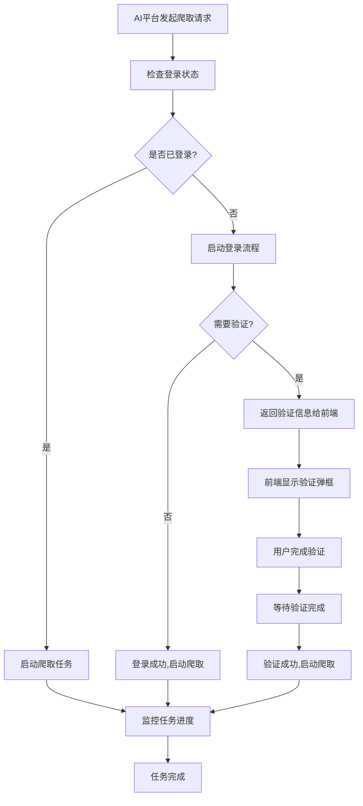

# AI赋能平台登录验证集成指南

## 概述

本文档详细说明如何在AI赋能平台中集成MediaCrawler的登录验证功能，实现当检测到账号需要手动验证时，在赋能平台直接弹框进行验证，验证完成后保存登录状态。

## 核心设计思路

### 1. 登录状态管理
- **会话管理**: 每个平台的登录状态独立管理，支持多会话
- **状态检查**: 实时检查登录状态，自动检测过期和失效
- **Cookie持久化**: 登录成功后自动保存cookies，支持后续使用

### 2. 验证流程设计
- **自动检测**: 爬虫启动时自动检查登录状态
- **智能提示**: 当需要验证时，返回详细的验证信息
- **状态同步**: 验证完成后自动更新登录状态

### 3. AI赋能平台集成
- **API接口**: 提供完整的登录管理API
- **前端集成**: 支持前端弹框显示验证信息
- **状态监控**: 实时监控验证进度

## 系统架构

```
AI赋能平台
    ↓
MediaCrawler API Server
    ↓
Login Manager (登录管理器)
    ↓
Browser Automation (浏览器自动化)
    ↓
Target Platform (目标平台)
```

## 核心组件

### 1. LoginManager (登录管理器)
```python
class LoginManager:
    - check_login_status(): 检查登录状态
    - start_login_process(): 启动登录流程
    - wait_for_verification(): 等待验证完成
    - save_login_session(): 保存登录会话
```

### 2. LoginAPI (登录API接口)
```python
@login_router.post("/check")      # 检查登录状态
@login_router.post("/start")      # 启动登录流程
@login_router.post("/wait-verification")  # 等待验证完成
@login_router.get("/sessions")    # 获取会话列表
```

### 3. AIPlatformIntegration (AI平台集成)
```python
class AIPlatformIntegration:
    - ensure_login(): 确保平台已登录
    - start_crawling_with_login_check(): 带登录检查的爬取
    - monitor_task_progress(): 监控任务进度
```

## 完整流程

### 1. 爬虫任务启动流程



### 2. 验证流程详细说明

#### A. 二维码验证流程
```python
# 1. 启动登录流程
result = await client.start_login_process("xhs", "qrcode")

# 2. 检查是否需要验证
if result["verification_required"]:
    verification_info = result["verification_info"]
    # 返回给前端显示二维码
    
# 3. 前端显示二维码
showQRCodeModal(verification_info)

# 4. 等待验证完成
verification_result = await client.wait_for_verification(session_id)

# 5. 验证成功后继续爬取
if verification_result["status"] == "success":
    start_crawler_task()
```

#### B. 短信验证流程
```python
# 1. 启动登录流程
result = await client.start_login_process("xhs", "phone")

# 2. 检查是否需要验证
if result["verification_required"]:
    verification_info = result["verification_info"]
    # 返回给前端显示短信验证界面
    
# 3. 前端显示短信验证界面
showSMSModal(verification_info)

# 4. 用户在浏览器中完成验证
# 5. 等待验证完成
verification_result = await client.wait_for_verification(session_id)
```

## API接口说明

### 1. 检查登录状态
```http
POST /api/v1/login/check
Content-Type: application/json

{
    "platform": "xhs",
    "session_id": "optional_session_id"
}
```

**响应示例:**
```json
{
    "session_id": "uuid",
    "status": "logged_in",
    "message": "已登录",
    "verification_required": false,
    "cookies": {...},
    "local_storage": {...}
}
```

### 2. 启动登录流程
```http
POST /api/v1/login/start
Content-Type: application/json

{
    "platform": "xhs",
    "login_type": "qrcode",
    "session_id": "optional_session_id"
}
```

**响应示例:**
```json
{
    "session_id": "uuid",
    "status": "need_verification",
    "message": "需要扫描二维码登录",
    "verification_required": true,
    "verification_type": "qrcode",
    "verification_data": {
        "qrcode_url": "data:image/png;base64,...",
        "browser_url": "https://www.xiaohongshu.com"
    }
}
```

### 3. 等待验证完成
```http
POST /api/v1/login/wait-verification
Content-Type: application/json

{
    "session_id": "uuid",
    "timeout": 300
}
```

**响应示例:**
```json
{
    "session_id": "uuid",
    "status": "success",
    "message": "登录成功",
    "verification_required": false,
    "cookies": {...},
    "local_storage": {...}
}
```

## 前端集成示例

### 1. JavaScript客户端
```javascript
class MediaCrawlerClient {
    async checkLoginStatus(platform, sessionId = null) {
        const response = await fetch(`${this.baseUrl}/api/v1/login/check`, {
            method: 'POST',
            headers: { 'Content-Type': 'application/json' },
            body: JSON.stringify({ platform, session_id: sessionId })
        });
        return await response.json();
    }
    
    async startLoginProcess(platform, loginType = 'qrcode', sessionId = null) {
        const response = await fetch(`${this.baseUrl}/api/v1/login/start`, {
            method: 'POST',
            headers: { 'Content-Type': 'application/json' },
            body: JSON.stringify({ 
                platform, 
                login_type: loginType, 
                session_id: sessionId 
            })
        });
        return await response.json();
    }
    
    async waitForVerification(sessionId, timeout = 300) {
        const response = await fetch(`${this.baseUrl}/api/v1/login/wait-verification`, {
            method: 'POST',
            headers: { 'Content-Type': 'application/json' },
            body: JSON.stringify({ session_id: sessionId, timeout })
        });
        return await response.json();
    }
}
```

### 2. 验证弹框示例
```javascript
function showQRCodeModal(verificationInfo) {
    const modal = document.createElement('div');
    modal.className = 'verification-modal';
    modal.innerHTML = `
        <div class="modal-content">
            <h3>${verificationInfo.title}</h3>
            <p>${verificationInfo.description}</p>
            
            <div class="instructions">
                ${verificationInfo.instructions.map(instruction => 
                    `<p>${instruction}</p>`
                ).join('')}
            </div>
            <button onclick="checkVerificationStatus()">检查验证状态</button>
        </div>
    `;
    document.body.appendChild(modal);
}
```

## 使用场景

### 1. 首次使用
```python
# AI平台首次调用爬虫
result = await frontend.handle_crawler_request("xhs", "美食", 50)

if result["type"] == "verification_required":
    # 显示验证弹框
    showVerificationUI(result["verification_info"])
    
    # 用户完成验证后
    verification_result = await frontend.handle_verification_completion(
        result["session_id"]
    )
    
    if verification_result["type"] == "success":
        # 继续爬取任务
        continue_crawler_task()
```

### 2. 会话过期处理
```python
# 检查现有会话
login_status = await client.check_login_status("xhs", session_id)

if login_status["status"] == "expired":
    # 会话过期，需要重新登录
    login_result = await client.start_login_process("xhs", "qrcode", session_id)
    
    if login_result["verification_required"]:
        # 显示验证弹框
        showVerificationUI(login_result["verification_info"])
```

### 3. 多平台管理
```python
# 管理多个平台的登录状态
platforms = ["xhs", "dy", "ks"]

for platform in platforms:
    # 检查每个平台的登录状态
    login_result = await integration.ensure_login(platform)
    
    if login_result["verification_required"]:
        # 为每个平台显示验证弹框
        showPlatformVerificationUI(platform, login_result["verification_info"])
```

## 配置说明

### 1. 环境配置
```bash
# MediaCrawler API服务地址
CRAWLER_API_URL=http://localhost:8000

# 登录数据存储目录
LOGIN_DATA_DIR=./login_data

# 浏览器数据目录
BROWSER_DATA_DIR=./browser_data
```

### 2. 平台配置
```python
platform_configs = {
    "xhs": {
        "name": "小红书",
        "login_types": ["qrcode", "phone"],
        "default_login_type": "qrcode",
        "session_timeout": 7 * 24 * 3600  # 7天
    },
    "dy": {
        "name": "抖音",
        "login_types": ["qrcode", "phone"],
        "default_login_type": "qrcode",
        "session_timeout": 7 * 24 * 3600
    }
}
```

## 错误处理

### 1. 常见错误类型
- **登录失败**: 验证码错误、网络异常等
- **会话过期**: cookies失效、登录状态丢失
- **验证超时**: 用户未在规定时间内完成验证
- **平台限制**: 被平台检测、IP限制等

### 2. 错误处理策略
```python
async def handle_login_error(error_type, error_message):
    if error_type == "verification_timeout":
        # 验证超时，重新启动登录流程
        return await restart_login_process()
    elif error_type == "session_expired":
        # 会话过期，清除旧会话，重新登录
        return await clear_session_and_relogin()
    elif error_type == "platform_limit":
        # 平台限制，等待一段时间后重试
        return await wait_and_retry()
```

## 最佳实践

### 1. 用户体验优化
- **清晰的提示信息**: 提供详细的操作指导
- **进度反馈**: 显示验证进度和状态
- **错误恢复**: 提供重试和恢复机制
- **多语言支持**: 支持中文和英文界面

### 2. 安全性考虑
- **会话隔离**: 不同用户使用不同的会话
- **数据加密**: 敏感信息加密存储
- **访问控制**: 限制API访问权限
- **日志记录**: 记录登录和验证日志

### 3. 性能优化
- **会话缓存**: 缓存登录状态，减少检查频率
- **并发控制**: 限制同时进行的登录数量
- **资源清理**: 及时清理过期的会话和浏览器实例
- **监控告警**: 监控登录成功率和异常情况

## 总结

通过这套登录验证集成方案，AI赋能平台可以：

1. **自动化管理**: 自动检查和管理各平台的登录状态
2. **用户友好**: 提供清晰的验证界面和操作指导
3. **状态持久化**: 保存登录状态，避免重复验证
4. **错误恢复**: 完善的错误处理和恢复机制
5. **扩展性强**: 支持多平台和多验证方式

这种设计确保了爬虫在各种网络环境下都能稳定运行，同时提供了良好的用户体验。 